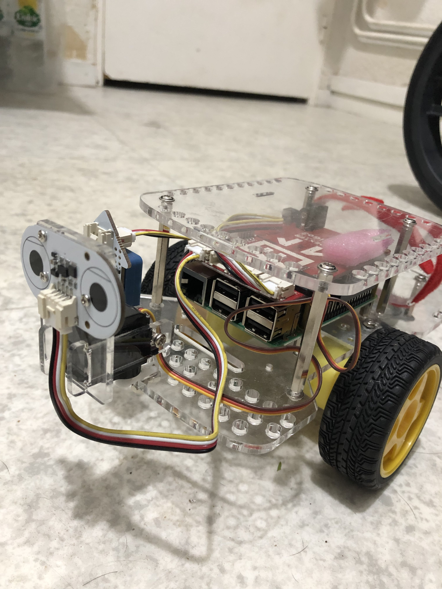

# JetsonAutonomousDriving

## Table of contents

1. [Presentation](#presentation)
2. [Project architecture](#project-architecture)

## Presentation

>The objective of this project is to explore the possibilities of NVIDIA's Jetson Nano card for real-time video processing. The idea is to develop a processing chain for the autonomous driving of a small robot-car.

Weekly report : https://www.overleaf.com/read/rnhmbsmgdsfd

## Project architecture

<pre><code>
JetsonAutonomousDriving/
      ├── src/                   
      |    ├── tutorial/                (Folder containing CNN/PyTorch tutorials)
      |    |    ├── cnn_pytorch_tutorial/
      |    |    └── kaggle_cnn_pytorch_tutorial/                 
      |    ├─── main/              
      |    |     ├── model_benchmark/    (Benchmarks of different CNN on Jetson card) 
      |    |     |    ├── models/        (Folder containing .pth files for each model tested)
      |    |     |    └── results.txt    (File containing some results and a link to google sheets)
      |    |     ├── model/              (Final model for our project)
      |    |     ├── segmentation/       (Segmentation experimentations)
      |    |     └── hand_gesture_model/ (Hand gesture experimentations) 
      |    └── robot/                    (Folder containing the robot-car scripts)
      ├── txt/                   
      |    ├── subject.pdf              (Original subject (in french))
      |    └── todo.txt            
      ├── assets/ 	                (Additional assets needed for the projects such as Jetson SDK) 
      ├── README.md		          
      └── LICENSE  
</pre></code>
